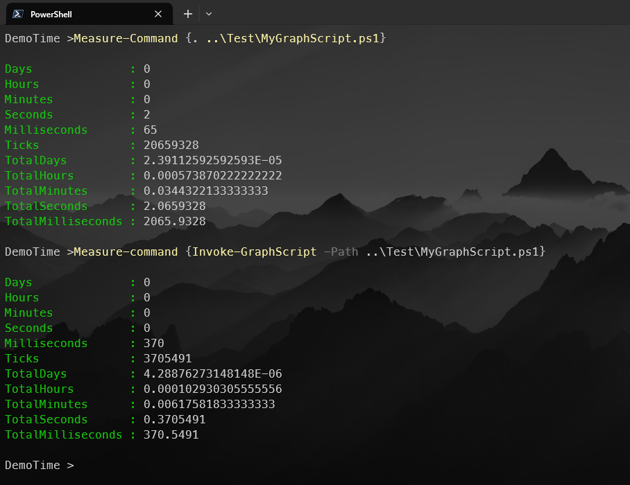

# GraphPreProcessor
A PowerShell Module to PreProcess Microsoft Graph Scripts via PowerShell
# 📘 Module Overview

This PowerShell module provides a preprocessing layer for Microsoft Graph-based scripts by analyzing their structure using the Abstract Syntax Tree (AST). Its primary goal is to identify **independent Graph API calls** — that is, calls which do not rely on dynamically generated input — and extract them into **structured batch request definitions** stored as JSON.

These batchable calls are then excluded from the original script, which is transformed into a **parameterized version** that consumes the responses from the batch requests. This process significantly reduces redundant API calls and speeds up execution, especially in repetitive or scheduled contexts.

The module maintains integrity and reusability by:

- Generating a `.GPP` folder next to the script to store:
  - A hash-based **meta file** for change detection,
  - A **parameterized script** with removed batchable calls,
  - The **batch request JSON** used to pre-fetch Graph data.
- Automatically detecting when the original script changes and reprocessing only when necessary.

This approach enables efficient, repeatable, and optimized execution of Microsoft Graph scripts — ideal for automation, CI/CD pipelines, and modular Graph development.

## Caution ⚠

This Module is only a PoC and has many edge cases that might break it!

## How to Execute

Create a script with many Graph commands

```PowerShell
$Users = Get-MGUser
$Groups = Get-MGGroup
$users2 = Get-MgUser
$Users3 = Get-MGUser
$Groups3 = Get-MGGroup
$users4 = Get-MgUser
$Users5= Get-MGUser
$Group6 = Get-MGGroup
$users7 = Get-MgUser
$Users8= Get-MGUser
$Group9 = Get-MGGroup
$users10 = Get-MgUser
$Users11= Get-MGUser
$Group12 = Get-MGGroup
$users13 = Get-MgUser
$Users14= Get-MGUser
$Group15 = Get-MGGroup
$users16 = Get-MgUser
$Users17= Get-MGUser
$Group18 = Get-MGGroup


return 'all good'
```

Store this file like C:\Temp\MyGraphScript.ps1

call it via

```PowerShell
Import-Module .\GraphPreProcessor.psm1
Invoke-GraphScript -Path C:\Temp\MyGraphScript.ps1
```

Result:


